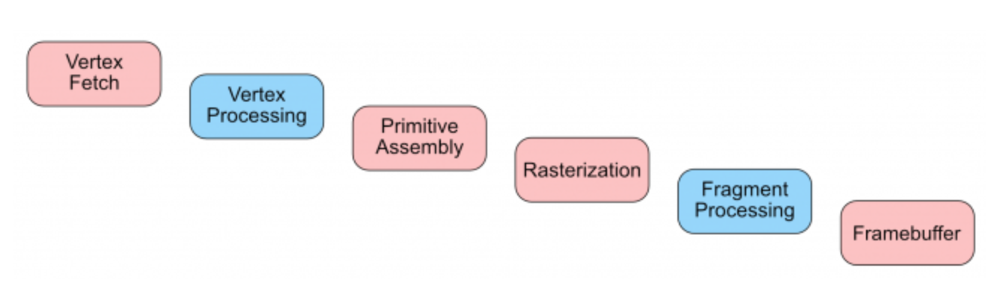
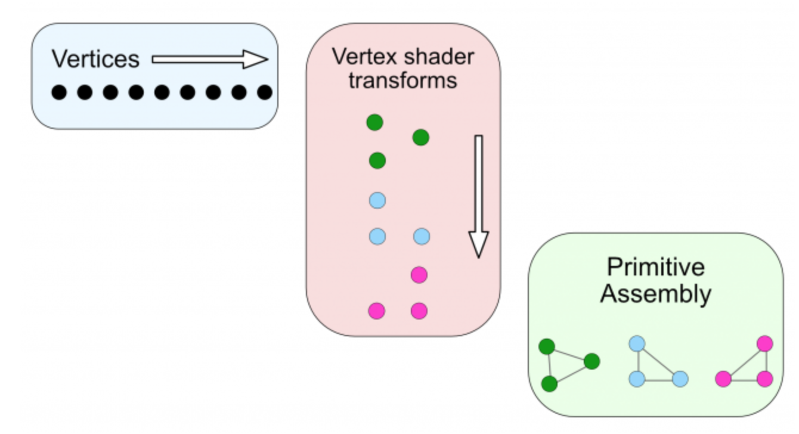
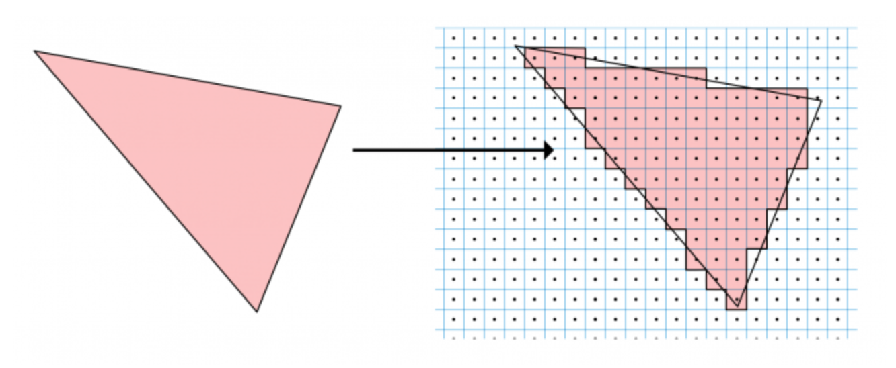

#### Metal渲染管线线程

Metal从顶点的获取到最后显示在屏幕上一共要经过6个过程，在此期间，顶点会在多个控件坐标系中进行转换，而我们需要关心的只有`顶点处理`和`片元处理`这两个过程，我们编写的着色器就是对应这两个过程的。

###### 1.Vertex Fetch（顶点获取）

使用`MTLVertexDescriptor`来描述顶点的属性读取方式，如位置，纹理坐标，法线和颜色。你也可以选择不使用顶点描述符，只将一组顶点缓存发送给 GPU 。前提是知道顶点缓冲是如何组织的。

当 GPU 获取顶点缓冲时，绘制时，需要告诉 `MTLRenderCommandEncoder` 缓冲是否有索引。如果缓冲没有索引，GPU 就假设缓冲是个数组，按顺序一次取一个元素。（顶点的数据是被缓存起来重用的，所以顶点的索引数据非常重要）

之后一个特殊的硬件单元叫做`Scheduler（调度器）`将顶点和他们的属性发送到下一个阶段。

###### 2.Vertex Processing（顶点处理）

在这个阶段，顶点是被单独处理的。你需要写着色器代码来计算逐顶点的光照和颜色。更重要的是，你要将顶点坐标，经过不同坐标空间的转换，来确定在最终帧缓冲中的位置。

`GPU`的不同结构中都包含了多`着色器核心`，专门负责顶点和片元的着色，并且这些核心可以并行的工作，使得顶点和片元的处理非常快。

计算单元能够处理（一次）大批量的顶点，数量取决于着色器核心的最大值。该批处理可以完整利用 `CU（计算单元）` 高速缓存，因此可以根据需要重用顶点。该批处理会让 `CU` 保持繁忙状态直到处理完成，但是其他的 `CU` 会变成可用状态以处理下一批次。

顶点处理一旦完成，高速缓存就会被清理，为下一批次顶点做好准备。此时，顶点已经被排序过，分组过了，准备被发送到下一阶段了。

###### 3.Primitive Assembly（图元组装）

Metal提供了5种基本的形状：

* `point`:为每个顶点光栅化一个点。你可以在顶点着色器中用属性[[point_size]]来指定点的尺寸。
* `line`:为每一对顶点光栅化出之间的线段。如果一个顶点已经包含在一条线上了，它就不能再被包含在另一条线上。如果顶点是奇数个，那么最后的顶点会被忽略掉。
* `lineStrip`:和前面的简单直线类似，但是 line strip 连接了所有邻近的顶点，形成了一个多段线。每个顶点（除了第一个）都连接到前一个顶点上。
* `triangle`:为每三个连续顶点光栅化出一个三角形。如果最末尾的顶点不能构成三角形，它们将被忽略。
* `triangleStrip`:和前面的简单三角形类似，但是一个顶点可以和相邻的三角形边构成新的三角形。

管线指定了顶点的旋转方向。如果旋转方向是逆时针的，那么三角形顶点的顺序就是逆时针的面，就是正面。否则，这个面就是背面，可以被剔除，因为我们看不到他们的颜色和光照。

当被其他图元遮挡时，该图元将会被剔除，但是，如果他们只是部分在屏幕外，他们将会被裁剪。

此时，图元已经从顶点被完全组装好了，并将进入到光栅化器。

###### 4.Rasterization（光栅化）

当前，有两种不同的渲染技术：光线追踪`ray tracing` 和 光栅化`rasterization`。

* 使用`光线追踪`时，从屏幕上的每一个点，发射一条射线到场景中，看看是否和场景中的物体有交点。如果有，将屏幕上像素的颜色改成距离屏幕最近的物体的颜色。
* `光栅化`是另一种工作方式,从场景中的每一个物体，发射射线到屏幕上，看看哪些像素被该物体覆盖了。深度信息也会像光线追踪一样被保留，所以，当有更近的物体出现时，会更新屏幕上像素的颜色。
* 当渲染内容是静态的，距离较远的时候，光线追踪效果更好；当内容非常靠近镜头且不断移动时，光栅化效果更好。

此时，上一阶段中发过来的连接后的顶点，会根据坐标被呈现在二维网格上。这一步就是三角形设置`triangle setup`。
这里，光栅化器需要计算任意两个顶点间线段的`斜率`。当三个顶点间的三个斜率都已知后，三角形就可以同这三条边构成。
之后进行扫描转换`scan conversion`，逐行扫瞄屏幕寻找交点，确定哪一部分是可见的，哪一部分是不可见的。要绘制屏幕上的点，只需它们的顶点和斜率就够了。扫瞄算法确定是否线段上的所有点或三角形内的所有点都是可见的，如果是可见的，就全都会被填充上颜色。

在光栅化完成后，三个另外的硬件单元接管了任务：

* 一个叫 `Hierarchical-Z` 的缓冲，负责移除那些被光栅化器标记为剔除的片段。
* `Z and Stencil Test` 单元接着对比片段与深度缓冲和模板缓冲，移除那些不可见的片段。
* 最后，插值器 `Interpolator` 单元接收剩余的可见片段，并从组装好的三角形属性中产生片段属性。

此时，调度器 `Scheduler` 单元再次将任务调度给着色器核心，但是这一次，光栅化后的片段被发送到 `Fragment Processing` 阶段。

###### 6.Fragment Processing（片元处理）

片段处理阶段是另一个可编程控制阶段。编写片元着色器代码，输出的光照，纹理坐标，深度和颜色信息。片段着色器的输出是该片段的颜色。每一个片段都会为帧缓冲中的最终像素颜色做出贡献。每个片段的所有的属性是插值得到的。

之后，GPU 接收片段并进行了一系列的后置处理测试：

* 透明测试 `alpha-testing` 根据深度测试来确定哪个透明物体将被绘制，哪一个不会被绘制。在有透明物体的情况下，透明测试alpha-testing会将新物体的颜色与先前保存的颜色缓冲中的颜色进行混合。
* 剪切测试 `scissor testing`检查一个片段是否在一个特定的矩形框内.
* 模板测试 `stencil testing` 检查片段所在的帧缓冲中的模板值，与我们选择的一个特定值之间的差别。
在前一阶段中运行过了提前 Z 测试 `early-Z testing`。现在 `late-Z testing` 也已经完成，以解决更多的可见性问题。模板和深度测试在环境光遮蔽与阴影中也非常有用。
* 最后，抗锯齿 `antialiasing` 也是在这里被计算的，这样最终显示在屏幕上的图像就不会看起来有锯齿了。

一旦片段已经被处理成像素，分配器 `Distributer` 单元将他们发送到色彩写入 `Color Writing` 单元。这个单元负责将最终颜色写入到一个特殊的内存位置叫做 `Framebuffer（帧缓冲）`。

###### 7.Framebuffer（帧缓存）

从这里，视图得到了每一帧刷新时的带有颜色的像素。
一个叫做 `double-buffering（双重缓存）` 的技术，将第一个缓存显示在屏幕上时，第二个在后台更新。然后，两个缓存被交换，第二个缓冲被显示在屏幕上，第一个被更新，一直循环下去。

到这里，这个渲染的过程就结束了。

