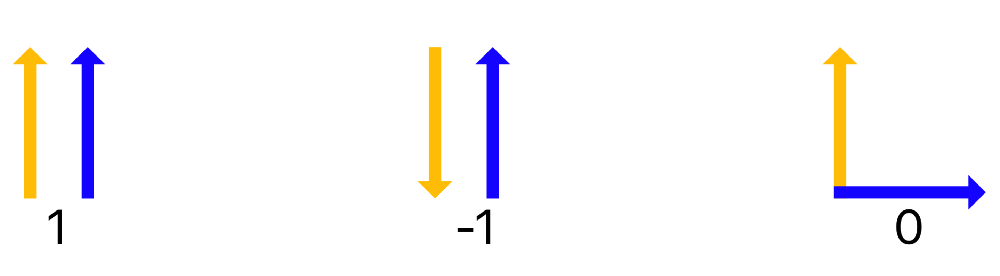
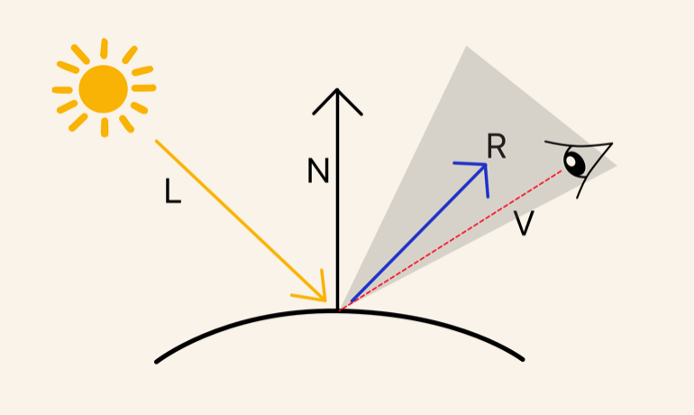

### 光照基础

现实中的光照是非常复杂的，光可以向不同的方向发射和反射，而且会受到诸多因素的影响，使用Phong光照模型可以很好地处理光照。

#### 光源

* 直射光源(`Directional Light`)，所有光线沿着一个方向发出。
* 点光源(`Point Light`)，光线从光源的四面八方发出。
* 聚光灯光源(`Spotlight`)，光线在一个特定的反向范围之内。

#### 冯氏光照模型(Phong Lighting Model)

> 该模型由漫反射光照（Diffuse Lighting）、镜面光照（Specular Lighting）、环境光照（Ambient Lighting）组成。

* 漫反射光照：理论上来说，当光线照射到一个平面上，会有一部分光照经过反射，并且反射光与入射光的夹角被该平面的法向量平分。然而在实际中，物体的平面会有很多微小的缝隙，所以一个平面上的反射光会从多个角度发出。因此产生了漫反射颜色，其中光强度正比于入射光和表面法线之间的角度。
* 镜面光照：物体越平滑，光就会从物体表面的几个角度反射而出，从而在物体表面出现亮点。镜面光照的颜色更偏向于光照的颜色。
* 环境光照：在现实生活中，处在黑暗的情况下，物体的表面也依然会有光亮（来自月亮、某些光源），物体不可能处于完全的黑暗。该物体此时呈现的颜色就是环境光颜色。

###### 向量的点乘

将向量标准化后进行点乘运算，我们可以得到这两个向量夹角的余弦值。使用该值来决定当前点的亮度。



##### 漫反射

我们会在世界空间中进行计算，定义顶点着色器返回的数据结构如下：

```metal
struct VertexOut {
  float4 position [[ position ]];
  float3 worldPosition;
  float3 worldNormal;
};
```
> 顶点着色器

在顶点着色器中进行计算，计算世界空间下顶点的坐标：

```metal
    VertexOut out;
   
    out.worldPosition = (uniforms.modelMatrix * vertexIn.position).xyz;

```

接着计算顶点的法向量，我们将法向量也转换到世界空间中需要一部额外的运算：
将法向量乘上正规矩阵(`normal matrix`)而不能直接使用模型矩阵(`model matrix`)，正规矩阵被定义为“模型矩阵左上角的3x3矩阵的逆矩阵的转置矩阵”，具体查看：[http://www.lighthouse3d.com/tutorials/glsl-12-tutorial/the-normal-matrix/](http://www.lighthouse3d.com/tutorials/glsl-12-tutorial/the-normal-matrix/)：

```swift
extension float3x3 {
  init(normalFrom4x4 matrix: float4x4) {
    self.init()
    columns = matrix.upperLeft().inverse.transpose.columns
  }
}
```

将顶点法向量转换到世界空间中：

```metal
out.worldNormal = uniforms.normalMatrix * vertexIn.normal;
```

> 片元着色器

定义变量：

```metal
float3 baseColor = float3(1, 1, 1);
float3 diffuseColor = 0;
```

标准化顶点到光源的向量与顶点的法向量，进行点乘运算，使用`saturate`确保值在0-1，相当于`max(0,min(1, value))`，运算得到漫反射颜色：

```metal
float3 lightDirection = normalize(light.position);
float diffuseIntensity = saturate( dot(lightDirection, normal) );
diffuseColor += baseColor * light.color * diffuseIntensity;
```

##### 镜面反射

物体镜面反射的强度与观察者的角度有关，因此要计算镜面反射颜色，我们还需要知道观察者（摄像机）在世界坐标空间的位置。


将摄像机的位置传入到片元着色器的参数当中：

```swift
fragmentUniforms.cameraPosition = camera.position
```
计算反射光的向量和当前片元到摄像机的反向向量，标准化向量之后，使用点乘计算两者之间的余弦值（保证其大于0），接着计算它与物体光亮值的幂，一个物体的光亮值越高，反射能力越强，散射能力越差。最后计算得到镜面反射颜色。

```metal
float3 reflection = reflect(lightDirection, normal);
 
float3 cameraPosition = normalize(in.worldPosition - fragmentUniforms.cameraPosition);
                
float3 specularIntensity = pow( saturate( dot(reflection, cameraPosition) ), materialShininess);
                
specularColor = specularIntensity * materialSpecularColor;
```

##### 环境光颜色

环境光颜色的计算非常简单，只需要将环境光的强度与光照颜色即可：

```metal
ambientColor += light.color * light.intensity;
```

##### 最终颜色

使用Phong光照模型，物体的最终颜色为：`color = diffuseColor + ambientColor + specularColor;`


