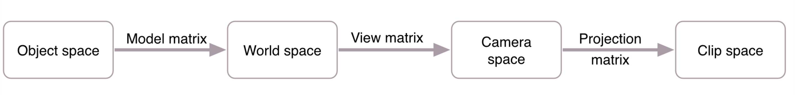

### 坐标空间

> 一个顶点在整个渲染线程中会经过多个坐标空间的转换，`metal`会将所有可见的顶点都变换到标准化设备坐标(NDC)中，接着会转会成屏幕的坐标，超出NDC的坐标都会被渲染。在转化到NDC之前，还需要经过多个坐标空间的变换。

* 物体空间(`Object space`) / 局部空间(`Local space`)

当前对象所在的坐标空间，比如，一个立方体，在物体空间中，坐标系原点可以为当前立方体的中心，其它的顶点在该坐标系中的坐标为局部坐标。

* 世界空间(`World space`)

我们想放置两个立方体在一个场景中，此时如果采用的是物体坐标系，则两个立方体会重叠在一起，只有在当前的空间中，为我们的不同的对象定义不同的位置，这个位置坐标采用的坐标系就是世界坐标系。

* 相机空间(`Camera space`) / 眼空间(`Eye space`)

采用相机或者眼的位置作为坐标的原点，空间中的不同顶点相对于原点的位置被称作眼坐标，视角的缩放、旋转等，其实就是相机空间中顶点的坐标在该控件中的变化、

* 裁剪空间(`Clip space`)

我们希望所有的坐标都在一个可见的范围中，在该空间中的坐标转换会将超出范围(-1.0~1.0)的顶点裁剪掉，进而不会进行渲染。

* 屏幕空间(`Screen space`)

将标准化的顶点坐标，转换成屏幕上的具体坐标。

#### OpenGL坐标转换过程
> Metal的坐标转换过程和OpenGL相似

1. 局部坐标是对象相对于局部原点的坐标；也是对象开始的坐标。
2. 将局部坐标转换为世界坐标，世界坐标是作为一个更大空间范围的坐标系统。这些坐标是相对于世界的原点的。
3. 接下来我们将世界坐标转换为观察坐标，观察坐标是指以摄像机或观察者的角度观察的坐标。
4. 在将坐标处理到观察空间之后，我们需要将其投影到裁剪坐标。裁剪坐标是处理-1.0到1.0范围内并判断哪些顶点将会出现在屏幕上。
5. 最后，我们需要将裁剪坐标转换为屏幕坐标，我们将这一过程成为视口变换(Viewport Transform)。视口变换将位于-1.0到1.0范围的坐标转换到由glViewport函数所定义的坐标范围内。最后转换的坐标将会送到光栅器，由光栅器将其转化为片段。

#### 转换过程
> 将坐标从一个坐标系转换到另一个坐标系，我们需要使用几个特定的矩阵

* 模型矩阵(`Model matrix`)

它通过对对象的移动、旋转、缩放将它置于在世界坐标系该在的位置上。

* 观察矩阵(`View matrix`)

从相机的角度观察到的对象是经过一些列的平移和旋转的组合，从而从一个特定的角度观察整个场景，我们将这些组合在一个矩阵中，从而将对象从世界空间转换到相机空间。

* 投影矩阵

它会指定坐标的范围，会将在范围内的坐标转换到NDC中，不在范围内的坐标将会被裁剪掉，导致不可见。

参考链接：
https://learnopengl-cn.readthedocs.io/zh/latest/01%20Getting%20started/08%20Coordinate%20Systems/
