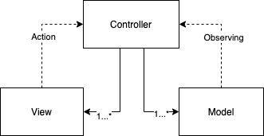

#### MVC

MVC 模式将对象分为 Model、View 和 Controller 三个部分。

* Model：负责数据。
*  View：负责视图，在 iOS 中一般为 UIView 的子类。
* Controller：控制器，在 iOS 中一般为 UIViewController。

控制器可以同时持有多个 Model 和 View，控制器中分别处理数据的监听和视图事件的回调。View 和 Model 都不能直接持有 Controller。

MVC 模式简单、容易理解，但随着复杂度的上升，Controller 会承担越来越多的职责，导致逐渐失去控制。

