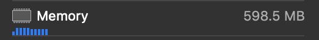
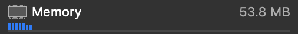
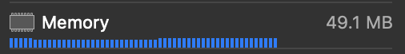
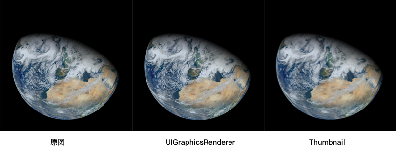

### 如何减少iOS应用内存的使用

首先介绍 `iOS` 中关于内存警告(`Memory Warning`) 和 `OOM` 和相关概念，之后介绍使用不同的图片渲染方式来降低内存的使用以及受到内存警告的时候应该怎么处理。

#### 内存警告与 OOM
`iOS` 系统和其它的现代操作系统一样，使用的都是虚拟内存，如今`iOS`系统能够使用的最大内存空间只有4GB，相比于安卓设备而言并没有拥有很大的内存空间。但`iOS`系统中每个应用可供支配的内存空间非常大，最大可达到`4GB`。

使用的虚拟内存总和大于物理内存总和该怎么办呢？在PC设备上或者是其它操作系统中，当物理内存不足时，可以将内存中的空间与硬盘中的控件交换，利用硬盘空间来拓展物理内存空间，这种机制被称作内存交换机制。而内存交换机制很容易影响手机硬盘的寿命，所以大部分移动操作系统并不支持内存交换机制，包括`iOS`。

那么，当内存不够的时候，`iOS` 会给应用进程发出内存警告，告知应用清理掉自己的不用的内存，在代码中 `- (void)didReceiveMemoryWarning` 方法会被调用，清理掉应用中不必要内存，释放内存空间。

如果在内存警告之后，内存空间依然不足的话，就会发生 `OOM`，应用会被系统 kill 掉，对于用户的体验就是"闪退"或者是从后台打开应用都需要重启应用。占用内存空间越大的应用越有可能发生 `OOM`，因此保持一个低内存使用率和实现`- (void)didReceiveMemoryWarning` 至关重要。

#### 内存占用率高的常见原因
##### 内存泄漏
循环引用导致的内存泄漏，这是内存高居不下的最常见原因，通过 `Xcode` 和 `Instrument` 来检测循环引用，本文不做详细介绍。
##### UIWebView
使用 `UIWebView` 会占用的大量内存，应该使用 `WKWebView` 来替代。
##### 图片相关
渲染分辨率高的的图片，或者是缩放、绘制大尺寸图片都会占用大量的内存空间，图片的编解码导致的高内存消耗，很容易引起卡顿甚至是 `OOM`。

#### 图片渲染
> 图片渲染需要消耗大量的内存，图片渲染的流程可以分成两个步骤：解码和渲染。

图片的解码过程将压缩的图片数据转换成能够被硬件所理解的数据，这个过程需要消耗内存来创建额外的数据缓存。
首先需要将压缩的图片数据加载到内存当中(Data Buffer)，以供解码过程使用，解码之后的图片数据也需要存放到内存当中(Image Buffer)，Image Buffer中包含着图片每一个像素的颜色和透明度信息，之后渲染过程中，硬件会这些信息将图片绘制到屏幕中。

假设我们要在 `iOS` 设备上使用 `[UIImage imageNamed:]`展示一张大小为 12MB 的图片，色彩空间为RGB，这张图片的分辨率为：3024 x 4032，Image Buffer 需要的内存空间为：每一个像素使用的位数(根据图片使用的色彩空间)，乘于图片的分辨率，即：32bits * 3024 * 4032 ~= 48 MB. 而尺寸那么大的一张图片，假如在Cell中展示，每一次使用，`[UIImage imageNamed:]`加载图片都会占用一块内存空间，而最终渲染到屏幕中空间并不需要用到那么多信息。

#### 减少图片渲染使用的内存

##### 1. 使用 UIGraphicsRenderer 来绘制图片
`UIGraphicsRenderer`可以根据指定尺寸和图片来绘制缩放的图片。当图片的尺寸很大，而展示图片的视图很小，使用`UIGraphicsRenderer`来替代`[UIImage imageNamed:]`可以节省大量的内存。`UIGraphicsRenderer` 使用指定的尺寸来创建对应的内存缓存，而不是使用图片的真实尺寸。iOS10 以上的版本应该使用 `UIGraphicsRenderer` 相关的API来替代 `UIGraphicsBeginImageContextWithOptions` / `UIGraphicsEndImageContext`。

###### Example
这张地球图片大小为20.9MB ，分辨率达到:12000 * 12000。(原图地址:[https://eoimages.gsfc.nasa.gov/images/imagerecords/78000/78314/VIIRS_3Feb2012_lrg.jpg](https://eoimages.gsfc.nasa.gov/images/imagerecords/78000/78314/VIIRS_3Feb2012_lrg.jpg))


在屏幕上一个 375pt * 375pt 的视图中展示该图片

* 使用 `[UIImage imageNamed:]` 加载图片，只加载该图片占用了 598.5MB 的内存空间。



* 使用 `UIGraphicsRenderer` 来创建对应尺寸的图片：

```objc
- (UIImage *)scaledImageWithURL:(NSURL *)url scaledSize:(CGSize)size {
	// 注：使用 contentOfFile 来创建图片不会创建缓存区，只有到绘制的时候才会创建。
    UIImage *image = [UIImage imageWithContentsOfFile:url.path];
    if (!image) {
        return nil;
    }
    UIGraphicsImageRenderer *renderer = [[UIGraphicsImageRenderer alloc] initWithSize:size];
    return [renderer imageWithActions:^(UIGraphicsImageRendererContext * _Nonnull rendererContext) {
        [image drawInRect:(CGRect){.origin = CGPointZero, .size = size}];
    }];
}
```

使用该方法仅仅占用了直接加载图片所使用内存的 1/10 不到：



###### 2.使用缩略图

使用 `CGImageSourceCreateThumbnailAtIndex` 可以创建缩略图(Thumbnil)，使用缩略图而不直接使用原图可以节省更多内存。

```objc
- (UIImage *)thumbnailImageWithURL:(NSURL *)url scaledSize:(CGSize)size {
    CGImageSourceRef imageSourceRef = CGImageSourceCreateWithURL((__bridge CFURLRef)url, nil);
    if (!imageSourceRef) {
        return nil;
    }
    NSDictionary *options = @{
           (id)kCGImageSourceThumbnailMaxPixelSize : @(MAX(size.width, size.height)),
           (id)kCGImageSourceCreateThumbnailFromImageAlways : @(YES)
       };
    CGImageRef thumbnailImageRef = CGImageSourceCreateThumbnailAtIndex(imageSourceRef, 0, (__bridge CFDictionaryRef)options);
    UIImage *thumbnailImage = [UIImage imageWithCGImage:thumbnailImageRef];
    
    CFRelease(imageSourceRef);
    CGImageRelease(thumbnailImageRef);
    
    return thumbnailImage;
}
```



使用缩略图和指定尺寸使用`UIGraphicsRenderer`会带来图片质量的下降，在可接受的范围之内，人眼是无法区别这些图片的。



###### 3. 使用 UIGraphicsRenderer 来合成图片
当需要一块展示多张图片的时候，可以使用 `UIGraphicsRenderer` 合成一张图片进行展示。不同的图片分别进行解码需要在内存中创建多块数据缓存，而使用 `UIGraphicsRenderer` 将多张图片在同一个上下文中进行渲染的话只需共用同一块内存区域用于图片数据的存储。

###### 4. 使用 Image I/O
// TODO: 待完成

#### 处理内存警告
1. 不要使用 `NSDictionary` 作为内存缓存使用，`NSDictionary` 在内存当中的类型为 `Compressed Memory`。当我们受到内存警告时，我们尝试将 `NSDitionary` 中的值释放掉，但由于字典处于压缩状态，在解压、释放其中部分内容之后，字段处于未压缩状态，此时内存的使用量可能比压缩状态下的还要多。应该使用 `NSCache` 作为内存缓存的容器，它会自己管理自己的内存，在适当的时候自行对内容进行释放。

2. 尽可能多的释放无用的资源，当接受到内存警告的时候，应用已经处在 `OOM` 的边缘，对于不可见的试图控制器和加载的图片、文件等进行释放。
3. 保存应用状态。应用随时会因为 `OOM` 而崩溃，保存当前应用的状态，并在下一次打开的时候对其进行复原。

#### 参考
1. [techniques-to-reduce-memory-footprint-and-oom-terminations-in-ios](https://medium.com/flawless-app-stories/techniques-to-reduce-memory-footprint-and-oom-terminations-in-ios-a0f6bef38217)
2. [image-resizing](https://nshipster.com/image-resizing/)
3. [iOS Memory 内存详解](https://juejin.im/post/5d3ee77ef265da039f1290b2)


